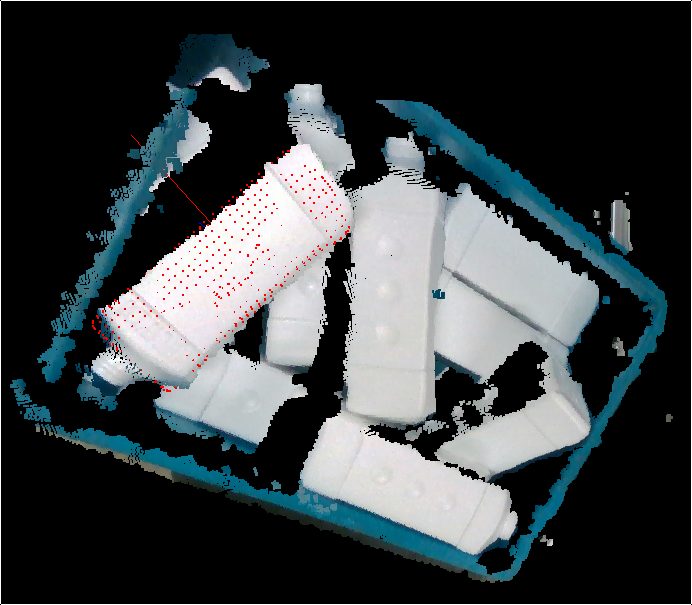

# Bin-Picking
Perception system using RealSense Camera for bin-picking

Project VForce implements the 3D-MRAI algorithm with C++.language. The the core implementation of 3D-MRAI algorithm is at src directory. Some useful tools are at tools directory. The tools directory also include the calibration projects RoboCamCal, which implements the camera calibration, stereo calibration and hand-eye calibration. The applications of the algorithm are at apps directory, which includes two applications: picking bottle and picking pad.

## Demo
Detection results(only show the one will be picked):



Bin-Picking animation:


More details can be found in my [Master thesis](https://github.com/freealong/thesis).

## Dependence
1. librealsense(<2.0)
2. PCL(Point Cloud Library)(>=1.7)
3. OpenCV(>=3.0.0)
4. PythonLibs(>=3.5)
6. Glog
7. Gflag

## How to build
```bash
cd PROJECT_DIR
mkdir build
cd build
cmake ..
make -j4
# build documents
make doc
```

### License [MIT](LICENSE.md)